---

**CertifySecure: Blockchain-Integrated Student Certificate Validation App with Flutter**

📑 **Table of Contents**

1. Project Overview
2. VS Code & Android Studio Setup
3. Frontend: Flutter & Dart Configuration
4. Android & iOS Setup
5. Pubspec.yaml Dependencies
6. Major Screens & UI Implementations
7. Blockchain & SHA-256 Hashing
8. Blockchain Technologies
9. Immutable Data & Blockchain Verification
10. Firebase Backend Setup
11. CSV-based User Registration
12. Firebase Authentication & Storage
13. Complete App Workflow
14. Verification Process & Tamper-Proof Certification
15. Facial Recognition for Student Authentication
16. User Roles & Permissions
17. Project Structure Breakdown
18. Git Cloning & Usage
19. Deployment Guide
20. Screenshots & Video Demo
21. Contact Details
22. Conference Presentation Details
23. Future Enhancements

---

### 1. Project Overview

CertifySecure is an innovative application designed to provide a secure and tamper-proof certification system for students. By integrating blockchain technology, facial recognition, and Firebase authentication, the app ensures that certificates are securely stored, verified, and authenticated through a decentralized and immutable process.

**Key Features:**
- 🔐 **Blockchain-Powered Certificate Storage:** Certificate hashes are stored immutably on the Ethereum blockchain.
- 🤖 **Facial Recognition for Secure Login:** A dedicated Flask-based service handles biometric authentication.
- ☁️ **Secure File Storage on Firebase:** Original certificates are securely stored in the cloud.
- 🔄 **Real-Time Verification for Recruiters:** Instant feedback on certificate authenticity.
- 🌐 **Multi-Platform Support:** Runs on Android, iOS, Web, and Desktop.
- 📊 **CSV-Based Bulk Registration:** Facilitates mass user onboarding.

---

### 2. VS Code & Android Studio Setup

**📌 VS Code Configuration**

- **Install Plugins:**
  - Flutter & Dart
  - Solidity

- **Settings:**
  Add the following to `settings.json` to ensure consistent formatting and quick access to Flutter dev tools:

  ```json
  {
      "editor.formatOnSave": true,
      "dart.previewFlutterUiGuides": true,
      "dart.openDevTools": "flutter"
  }
  ```

**📌 Android Studio Configuration**

- **Install Plugins:**
  - Flutter & Dart SDKs

- **Enable Developer Mode & USB Debugging:**
  - On a physical device, enable developer mode and USB debugging.

- **Emulator Setup:**
  - Create an emulator via AVD Manager with appropriate API level and specs.

---

### 3. Frontend: Flutter & Dart Configuration

**🔧 Install Flutter SDK (>=3.4.3)**
- Follow the official Flutter installation guide for your operating system.

**🔍 Run Commands:**
- Ensure your Flutter environment is properly set up by running:

  ```bash
  flutter doctor
  flutter pub get
  flutter run
  ```

**Why Dart?**
- **Performance:** Compiles to native code for fast execution.
- **Productivity:** Hot reload feature for quick iterations.
- **Cross-Platform Support:** Single codebase for Android, iOS, Web, and Desktop.

---

### 4. Android & iOS Setup

**Android:**
- 🛠️ **Configure `android/app/build.gradle`:** Set up signing, version codes, and permissions.

**iOS:**
- 💻 **Run `pod install` in the `ios/` directory.**
- 📝 **Configure Xcode with `GoogleService-Info.plist`.**
- 📱 **Ensure devices/emulators are connected and properly configured.**

---

### 5. Pubspec.yaml Dependencies

**Authentication & Firebase:**
- `firebase_core`, `firebase_auth`: Manages Firebase initialization and authentication.

**Security & Encryption:**
- `crypto`, `encrypt`, `pointycastle`: Provides SHA-256 hashing and AES encryption functionalities.

**Blockchain Integration:**
- `web3dart`, `walletconnect_dart`: Facilitates Ethereum blockchain interactions and wallet connections.

**Face Recognition & Camera:**
- `google_mlkit_face_detection`, `camera`: Handles facial detection and image capture.

**Networking & File Handling:**
- `dio`, `http`, `file_picker`: Used for API requests and file uploads.

**UI Enhancements:**
- `animate_do`, `cupertino_icons`: Enhances animations and icon usage.

---
### 6. Major Screens & UI Implementations  

**📱 Feature Screenshots**  

- **🚀 Splash Screen & Role Selection:**  
  - **Description:** Initial welcome screen with app branding and user role selection.  
  - **Files:** `splash_screen.dart`, `role_selection_screen.dart`  
  <br><br>
  <div align="center">
    <table>
      <tr>
        <td>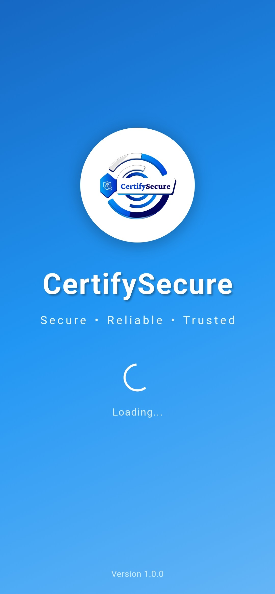</td>
        <td>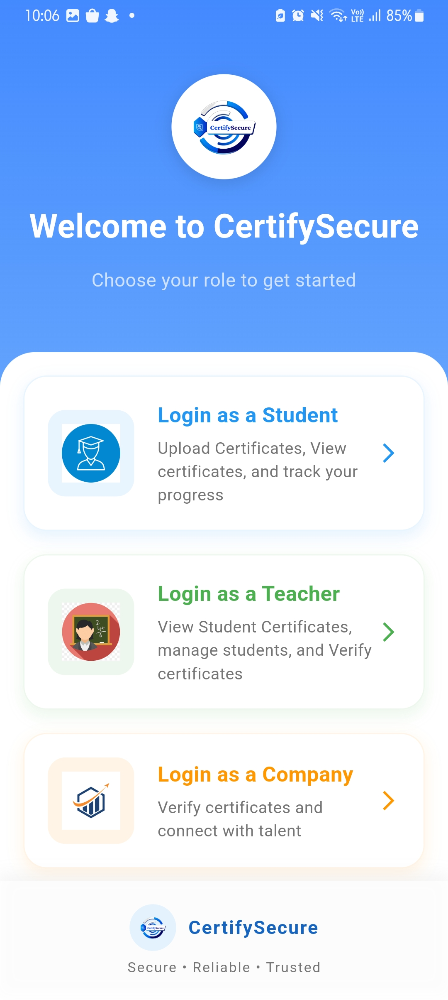</td>
      </tr>
    </table>
  </div>
  
  <br><br>

- **🔑 Login Screens (All Roles):**  
  - **Description:** Different login interfaces for students, teachers, and recruiters.  
  - **Files:** `login.dart`, `face_recognition_screen.dart`, `teacher_login.dart`, `company_login.dart`  
  <br><br>
  <div align="center">
    <table>
      <tr>
        <td>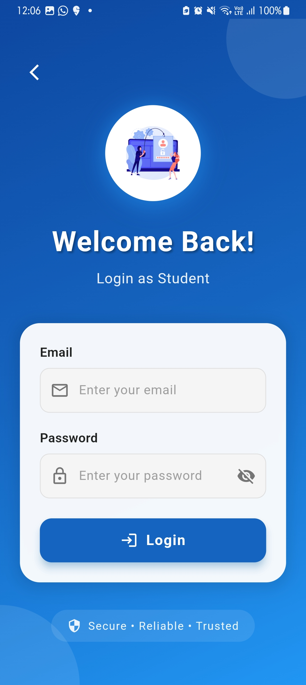</td>
        <td>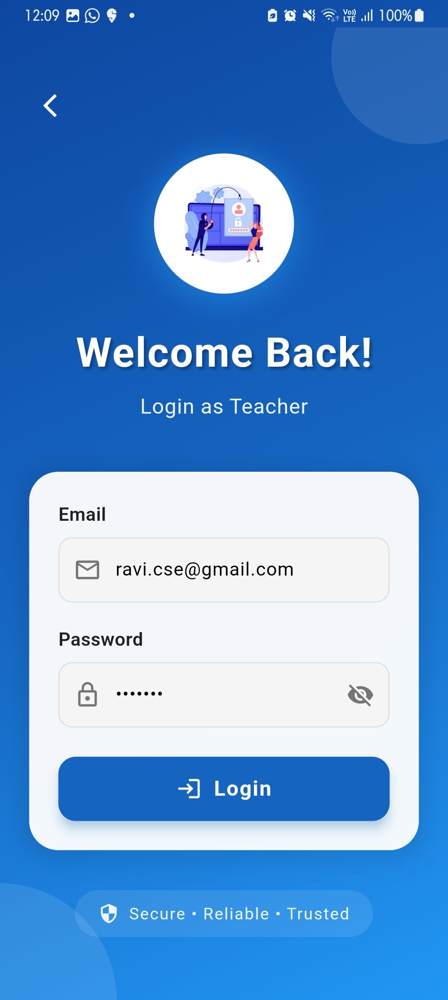</td>
      </tr>
      <tr>
        <td>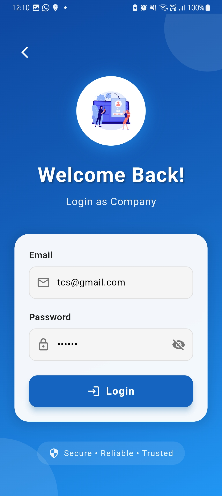</td>
        <td></td>
      </tr>
      <tr>
        <td></td>
        <td></td>
      </tr>
    </table>
  </div>

  <br><br>

- **🏠 Student Dashboard:**  
  - **Description:** Displays certificate statuses, upload options, and profile details for students.  
  - **Files:** `student_dashboard.dart`, `home_screen.dart`, `profile_screen.dart`  
  <br><br>
  <div align="center">
    <table>
      <tr>
        <td>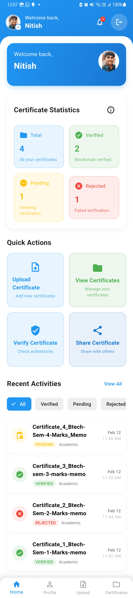</td>
        <td>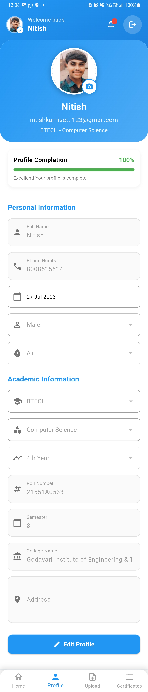</td>
      </tr>
    </table>
  </div>

  <br><br>

- **📤 Certificate Upload Screen:**  
  - **Description:** Allows students to upload their certificates with an option to generate a SHA-256 hash.  
  - **Files:** `upload_certificate_screen.dart`  
  <br><br>
  <div align="center">
    <table>
      <tr>
        <td>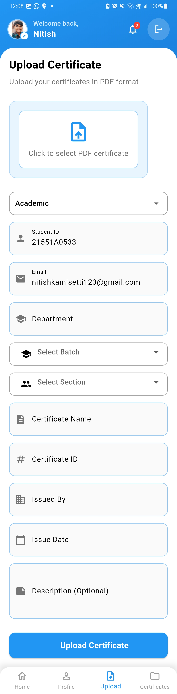</td>
      </tr>
    </table>
  </div>

  <br><br>

- **👀 View Certificates Screen:**  
  - **Description:** Enables students to view all their submitted certificates along with verification status.  
  - **Files:** `view_certificates_screen.dart`  
  <br><br>
  <div align="center">
    <table>
      <tr>
        <td>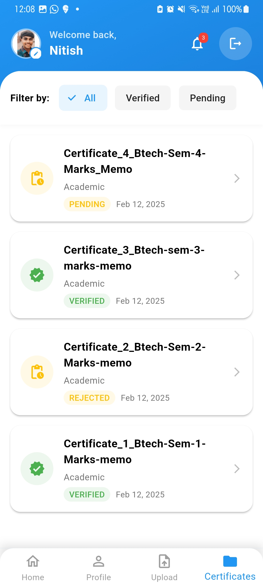</td>
      </tr>
    </table>
  </div>

  <br><br>

- **📊 Teacher Dashboard:**  
  - **Description:** Provides teachers with tools to verify certificates, view pending verifications, and access their profile.  
  - **Files:** `teacher_dashboard.dart`, `teacher_home_screen.dart`, `teacher_profile_screen.dart`  
  <br><br>
  <div align="center">
    <table>
      <tr>
        <td>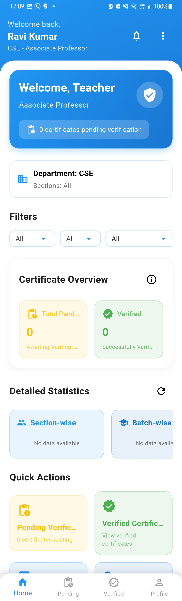</td>
        <td>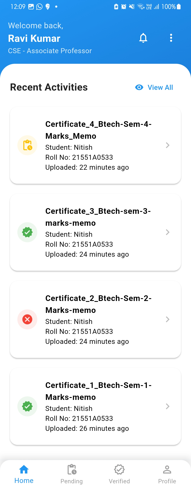</td>
      </tr>
      <tr>
        <td>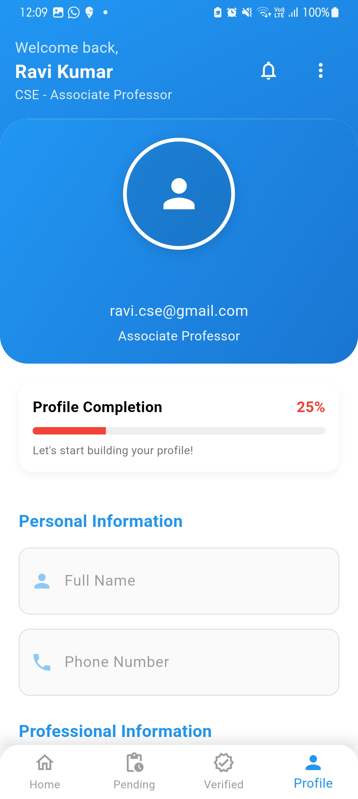</td>
        <td></td>
      </tr>
    </table>
  </div>

  <br><br>

- **🏢 Company/Recruiter Dashboard:**  
  - **Description:** Enables recruiters to scan QR codes and validate certificate authenticity.  
  - **Files:** (Located under the `company/` folder)  
  <br><br>
  <div align="center">
    <table>
      <tr>
        <td>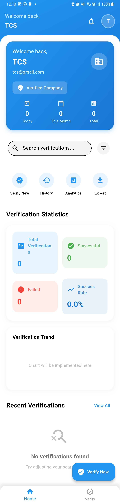</td>
        <td>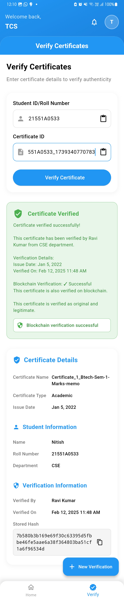</td>
      </tr>
      <tr>
        <td>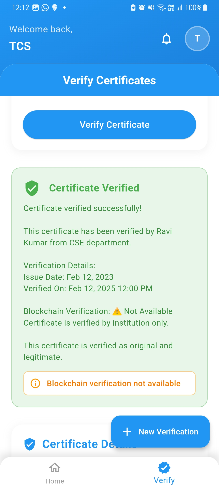</td>
        <td></td>
      </tr>
    </table>
  </div>

  <br><br>

---

### 7. Blockchain & SHA-256 Hashing

**🔒 SHA-256 Hash Generation:**
Certificates are processed to generate a SHA-256 hash, creating a unique digital fingerprint.

**Example:**

```dart
class CertificateHasher {
  static Future<String> generateHash(File certificate) async {
    final bytes = await certificate.readAsBytes();
    final hash = sha256.convert(bytes);
    return hash.toString();
  }
}
```

**⛓️ Blockchain Storage:**
The generated hash is stored on the Ethereum blockchain using a smart contract.

**Solidity Example:**

```solidity
// SPDX-License-Identifier: MIT
pragma solidity ^0.8.0;

contract CertificateRegistry {
    struct Certificate {
        string studentId;
        string hash;
        uint256 timestamp;
    }

    mapping(string => Certificate) private certificates;

    function storeCertificateHash(string memory studentId, string memory hash) public {
        certificates[studentId] = Certificate(studentId, hash, block.timestamp);
    }

    function getCertificateHash(string memory studentId) public view returns (string memory) {
        return certificates[studentId].hash;
    }
}
```

**📡 Blockchain Service:**
The `blockchain_service.dart` file uses `web3dart` to interact with the deployed smart contract, sending transactions via Infura and signing with MetaMask.

---

### 8. Blockchain Technologies

**🛠️ Remix IDE:**
- **Purpose:** A browser-based IDE for developing, deploying, and testing smart contracts written in Solidity.
- **Usage:** Used to write and deploy the `certificate_registry.sol` smart contract.

**🦊 MetaMask:**
- **Purpose:** A browser extension and mobile app that allows users to interact with the Ethereum blockchain.
- **Usage:** Used for managing Ethereum accounts and signing transactions.

**🌐 Sepolia Test Network:**
- **Purpose:** A test network for Ethereum that allows developers to test smart contracts without using real Ether.
- **Usage:** Used for deploying and testing the smart contract in a safe environment.

**🔗 Infura:**
- **Purpose:** Provides scalable Ethereum infrastructure and APIs.
- **Usage:** Used to connect the app to the Ethereum network, enabling blockchain interactions.

**💻 Solidity:**
- **Purpose:** A programming language for writing smart contracts on Ethereum.
- **Usage:** Used to write the smart contract that stores certificate hashes.

---

### 9. Immutable Data & Blockchain Verification

**🔒 Immutable Data:**
Once a certificate hash is stored on the blockchain, it cannot be changed or deleted, ensuring data integrity.

**✅ Verification Process:**
- Teachers verify certificates by generating a fresh hash and comparing it with the blockchain-stored hash. A mismatch indicates tampering.

---

### 10. Firebase Backend Setup

**🔥 Firestore Database:**
- **Purpose:** Stores user data, certificate metadata, and verification statuses.
- **Collections:** `users`, `certificates`

**☁️ Firebase Storage:**
- **Purpose:** Secures the original certificate files.

**🔑 Firebase Authentication:**
- **Purpose:** Manages user sign-up, login, and authentication.

**🚫 Firebase App Check:**
- **Purpose:** Ensures that only verified app instances can access backend resources.

---

### 11. CSV-based User Registration

**📄 Bulk Registration:**
Users are imported in bulk using a CSV file, streamlining the onboarding process.

**🛠️ Script:**
The `import_users.js` file in the `firebase-admin-server/` directory reads the CSV, validates data, and registers users in Firebase Authentication and Firestore.

**Example CSV:**

```csv
email,uid,password,role,name,imagePath,department,branch,course,year,semester
student@example.com,UID123,pass123,student,Student Name,/path/to/image.jpg,CSE,Computer Science,BTECH,3,6
teacher@example.com,UID456,pass456,teacher,Teacher Name,,,,,,
company@example.com,UID789,pass789,company,Company HR,,,,,,
```

**Process:**
- **Read CSV File:** The script reads the CSV file containing user details.
- **Validate Data:** Ensures all required fields are present and correctly formatted.
- **Register Users:** Adds users to Firebase Authentication and Firestore.

---

### 12. Firebase Authentication & Storage

**🔑 Firebase Authentication:**
- **Supports:** Email/Password, Google Sign-In, and biometric login (facial recognition).
- **Security Rules:** Implemented to ensure that only authorized users can access or modify data.

**🗄️ Firestore Database:**
- **Purpose:** Stores user profiles, certificate data, and verification logs.

**☁️ Firebase Storage:**
- **Purpose:** Stores original certificate files securely.

**🚫 Firebase App Check:**
- **Purpose:** Ensures that only verified app instances can access backend resources.

---

### 13. Complete App Workflow

**🤩 Student Registration & Login:**
- **Process:** Students register and log in using Firebase Authentication; facial recognition is used as an additional security layer.

**📤 Certificate Upload:**
- **Process:** Students upload certificates, and a SHA-256 hash is generated from each file.

**⛓️ Blockchain Storage:**
- **Process:** The certificate hash is stored on the Ethereum blockchain via a smart contract.

**👩‍🏫 Teacher Verification:**
- **Process:** Teachers review and verify certificates; verified certificates update Firestore.

---

### 14. Verification Process & Tamper-Proof Certification

**🔎 Tamper-Proof Mechanism:**
- **Mechanism:** The immutable nature of blockchain ensures that any alteration in the certificate changes the hash, flagging tampering.

**👩‍🏫 Teacher’s Role:**
- **Role:** Teachers verify the certificate manually before the hash is stored on-chain, ensuring authenticity.

---

### 15. Facial Recognition for Student Authentication

**🤖 Face Recognition Service:**
- **Implementation:** A separate Flask-based microservice using OpenCV.
- **Repository Link:** [Face Recognition Service Repository](https://github.com/Nitish2773/face-recognition-app)

**🔒 Purpose:**
- **Security:** Ensures that only the genuine student can log in and upload certificates, preventing impersonation.

---

### 16. User Roles & Permissions

| Role     | Permissions                                                                 |
|----------|------------------------------------------------------------------------------|
| Student  | 📤 Upload certificates, 👁️ View own certificates, 🔄 Request verification     |
| Teacher  | ✅ Verify certificates, 📝 Approve/Reject uploads, 📊 Manage verification records |
| Company  | 🔍 Validate certificate authenticity, 📄 Access verification history          |

---

### 17. Project Structure Breakdown

Here's a detailed breakdown of the project structure for the CertifySecure app:

```
certify_secure_app/
├── .idea/                     # 🛠️ IntelliJ & Android Studio settings
├── .vscode/                   # 📝 VS Code workspace settings and recommended extensions
├── android/                   # 🤖 Android-specific configuration files
│   ├── gradle/                # 🔨 Gradle build scripts and configurations
│   ├── app/                   # 📱 Main Android application code, resources, manifests
│   ├── build.gradle           # 🛠️ Android Gradle configuration file
│   └── other Android config files
├── assets/                    # 🖼️ Static assets (images, icons, fonts)
│   └── images/                # 📷 Application images (logos, splash screens, etc.)
├── build/                     # ⚙️ Compiled build artifacts (auto-generated)
├── firebase-admin-server/     # 🔥 Firebase Admin SDK scripts for batch operations  
│   ├── node_modules/          # 📦 Node.js dependencies
│   ├── import_users.js        # 📄 CSV user import script
│   ├── package.json           # 📃 Node.js dependency definitions
│   └── package-lock.json      # 🔒 Locked dependency versions
├── ios/                       # 🍎 iOS-specific configuration files (Xcode projects, etc.)
├── lib/                       # 💻 Flutter application source code
│   ├── CertifySecure/         # 🎯 Main application folder
│   │   ├── contracts/         # 📜 Solidity smart contracts for blockchain integration
│   │   │   └── certificate_registry.sol  # 🔗 Smart contract for certificate hashing
│   │   ├── models/            # 🗄️ Data models
│   │   │   └── certificate_model.dart  # 📃 Dart model for certificate data
│   │   ├── Screen/            # 🎨 UI Screens (organized by role/function)
│   │   │   ├── common/        # 🔄 Shared UI components
│   │   │   ├── company/       # 🏢 Screens for recruiter/company users
│   │   │   ├── login/         # 🔑 Authentication screens
│   │   │   │   ├── face_recognition_screen.dart # 🤖 Face recognition login
│   │   │   │   └── login.dart # 📲 Standard login screen
│   │   │   ├── main/          # 🏠 Main entry/home screens
│   │   │   ├── student/       # 🎓 Student-specific screens
│   │   │   └── teacher/       # 👩‍🏫 Teacher-specific screens
│   │   ├── Services/          # 🔧 Backend services
│   │   │   ├── blockchain_service.dart # ⛓️ Blockchain interactions
│   │   │   └── storage_utils.dart # ☁️ Firebase Storage utility functions
│   │   ├── utils/             # 🛠️ Utility functions
│   │   └── Widgets/           # 🔷 Reusable UI components
│   └── main.dart              # 🚀 App entry point
├── test/                      # 🧪 Unit & widget tests
├── .gitignore                 # 🚫 Files/directories ignored by Git
├── analysis_options.yaml      # 🔍 Linting and code analysis rules
├── pubspec.lock               # 🔒 Locked dependency versions
├── pubspec.yaml               # 📃 Flutter dependency & asset declarations
└── README.md                  # 📖 Project documentation (this file)
```

### 18. Git Cloning & Usage

**🚀 Clone the Repository:**
To get started with the CertifySecure app, clone the repository and navigate to the project directory:

```bash
git clone https://github.com/your-org/certifysecure.git
cd certify_secure_app
```

**📦 Install Dependencies:**
Ensure all dependencies are installed by running:

```bash
flutter pub get
```

**▶️ Run the App:**
Launch the app on your preferred platform:

```bash
flutter run
```

---

### 19. Deployment Guide

**Flutter App Deployment:**

**📱 Build for Android:**
Generate an APK for Android devices:

```bash
flutter build apk
```

**🍎 Build for iOS:**
Prepare the app for iOS deployment:

```bash
flutter build ios
```

**☁️ Deploy Web Version:**
Deploy the web version using Firebase:

```bash
firebase deploy
```

**Smart Contract Deployment:**

**⛓️ Deploy `certificate_registry.sol`:**
Use Remix IDE to deploy the smart contract.

**📝 Update `blockchain_service.dart`:**
Ensure the deployed contract address is updated in the service file.

**Backend Deployment on Render:**
Create a `render.yaml` file for deployment:

```yaml
services:
  - type: web
    name: certifysecure-api
    env: python
    buildCommand: pip install -r requirements.txt
    startCommand: python main.py
```

---

## **20. Screenshots & Video Demo**  

### **🔹 Firebase Console**  

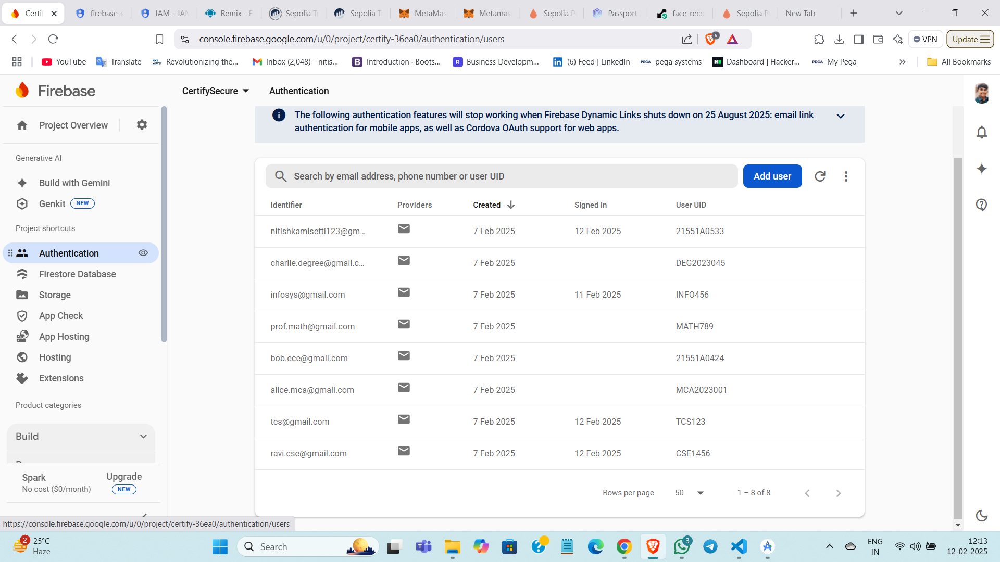  
  
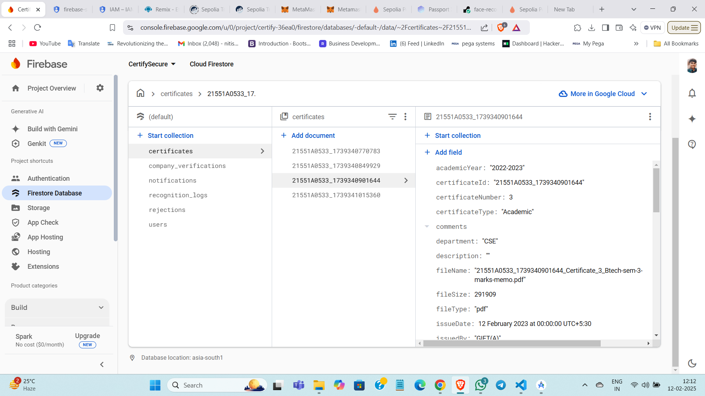  

### **🔹 Remix IDE**  
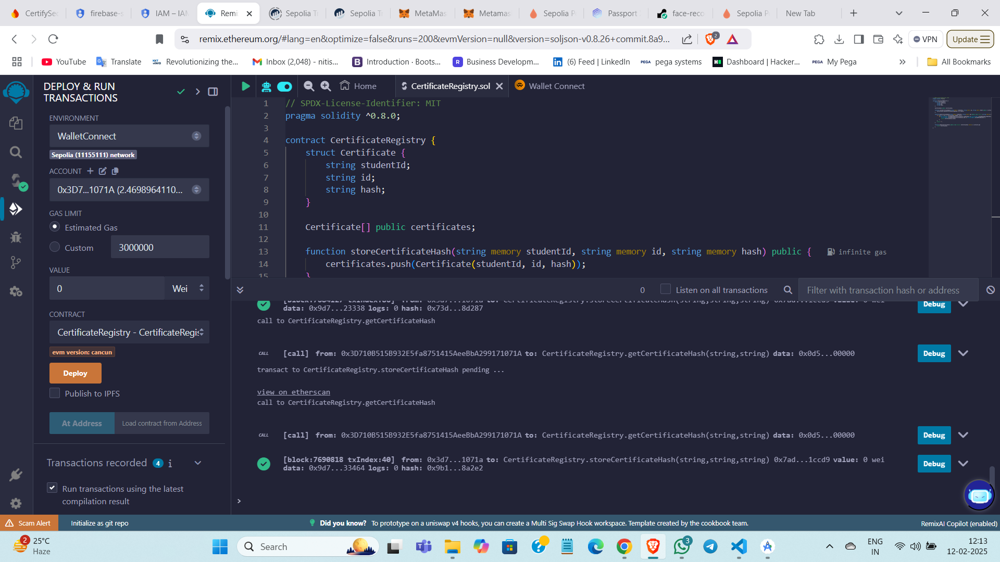  
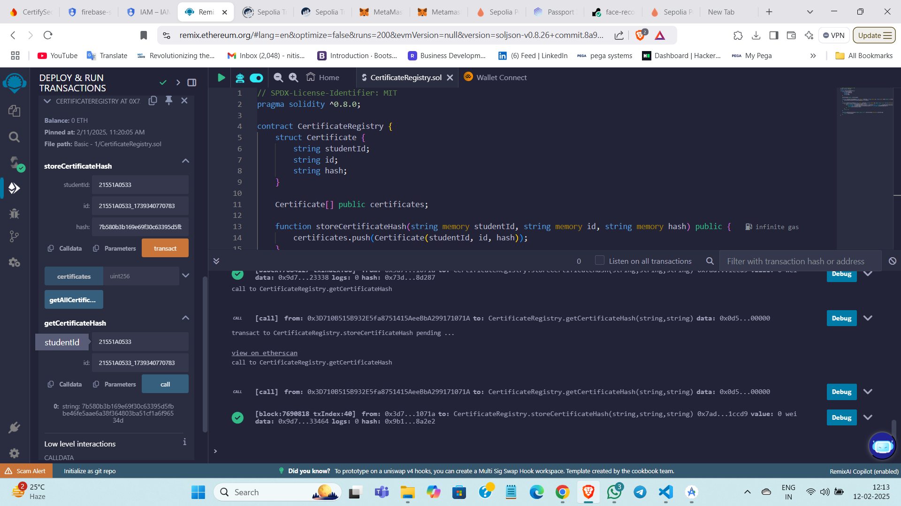  

### **🔹 MetaMask Wallet**  
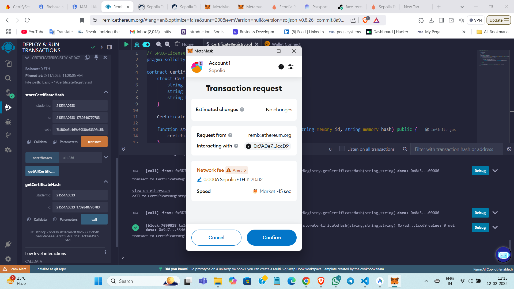  

### **🔹 Infura Dashboard**  
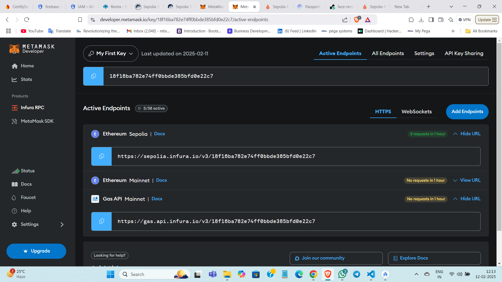  
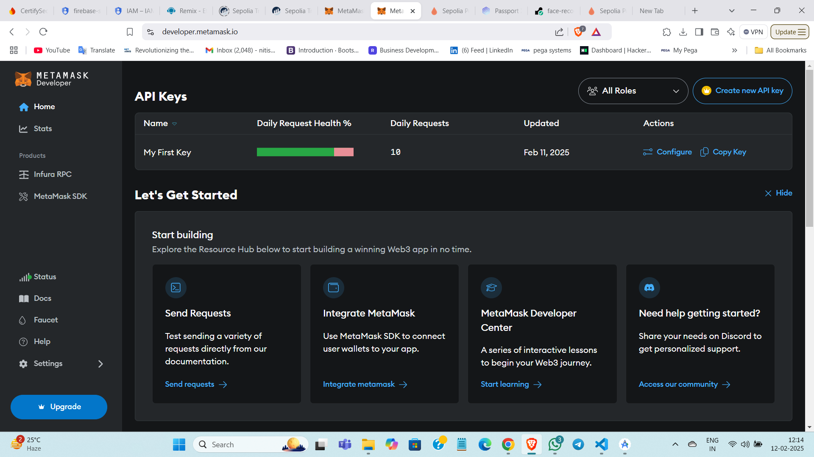 

### **🔹 Render App Dashboard**  
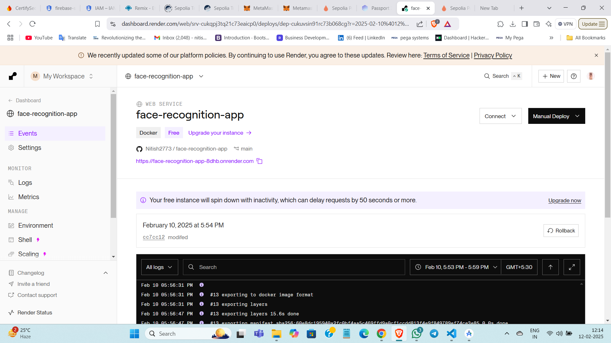  

---

## **📹 Video Demo**  
  

*(Click on the image to watch the full demo video.)*  

---

### 21. Contact Details

For any inquiries or further information, please contact:

- **Project Lead:** Sri Nitish Kamisetti
- **Email:** nitishkamisetti123@gmail.com
- **LinkedIn:** [LinkedIn Profile](https://www.linkedin.com/in/sri-nitish-kamisetti/)
- **GitHub:** [GitHub Profile](https://github.com/Nitish2773)

---

### 22. Conference Presentation Details

**🎤 Presentation Title:**
"CertifySecure: Blockchain-Integrated Student Certificate Validation App with Flutter"

**🗓️ Conference:**
- **Name:** International Conference on Innovative Product Design and Intelligent Manufacturing Systems (ICIPDIMS 2024) Organized by AITAM College
- **Date:** 04-12-2024
- **Location:** Remote

**📄 Abstract:**
In the education sector, certificates are awarded to students who complete their studies. This project mainly addresses the difficulties faced in submitting the certificates to the company for getting jobs in the public or private sectors. Students present these certificates for applying for jobs, where all these certificates need to be verified manually. The students can tamper or submit fake academic certificates. So, to avoid such problems, blockchain technology is used to establish a decentralized network for storing and validating certificates. Because blockchain is more secure, immutable, and provides trust between educational institutions, teachers, and recruiters. Existing methods of validating student certificates often suffer from secure authentication. There is a lack of advanced features of facial recognition for the students, and it mitigates the risk of tampering with the student credentials. This project utilizes Flutter and Firebase for mobile app development and integrates blockchain for tamper-proof certificates.

**Keywords:** Certificate verification, Facial Recognition, Secure Authentication, Blockchain, Flutter, Remix IDE, MetaMask.

**📈 Presentation Slides:**
- **Link to Slides** [Link to Slides](https://docs.google.com/presentation/d/1m_h0iNQmb39QIWQBq8qdor8nygsJoeC0/edit?usp=sharing&ouid=114377696364244652161&rtpof=true&sd=true)

---

### 23. Future Enhancements

- **QR Code Verification:**
  - **Future Implementation:** Integrate QR code scanning for quick validation of certificates by recruiters.
  - **Purpose:** Enhance the verification process by allowing recruiters to scan a QR code linked to a certificate to retrieve the blockchain-stored hash.

- **Additional Screenshots:**
  - **Include:** Screenshots of Firebase console, Remix IDE, MetaMask, Infura, and other relevant tools.

- **Advanced Features:**
  - **Explore:** Additional security features and integrations to further enhance the app's capabilities.

---