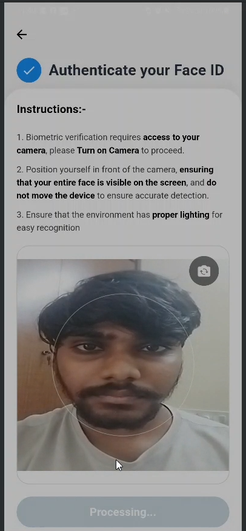
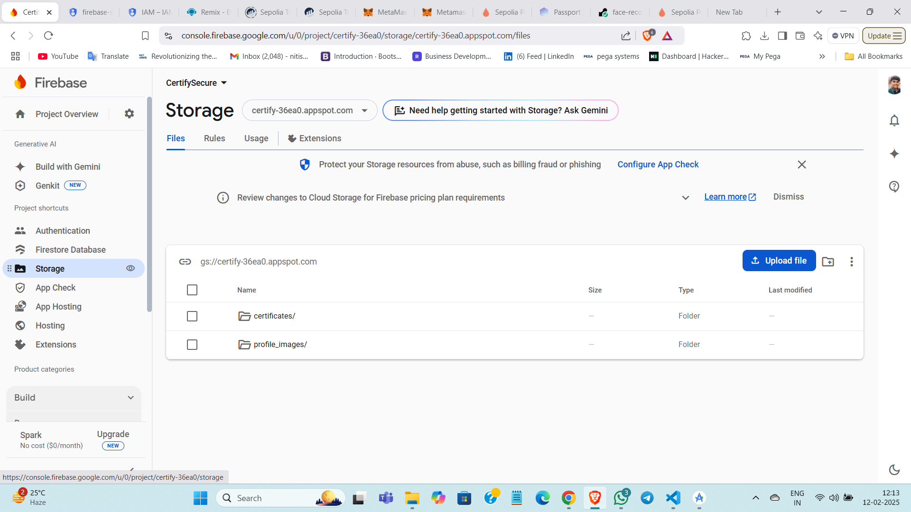

# CertifySecure: Blockchain-Integrated Student Certificate Validation App with Flutter
---

# 📑 **Table of Contents**  

### 🚀 **Project Setup & Configuration**  
1️⃣ **[Project Overview](#)**  
2️⃣ **[VS Code & Android Studio Setup](#)**  
3️⃣ **[Frontend: Flutter & Dart Configuration](#)**  
4️⃣ **[Android & iOS Setup](#)**  
5️⃣ **[Pubspec.yaml Dependencies](#)**  

### 🎨 **UI & User Experience**  
6️⃣ **[Major Screens & UI Implementations](#)**  

### 🔗 **Blockchain & Security**  
7️⃣ **[Blockchain & SHA-256 Hashing](#)**  
8️⃣ **[Blockchain Technologies](#)**  
9️⃣ **[Immutable Data & Blockchain Verification](#)**  

### 🔥 **Backend & Database**  
🔟 **[Firebase Backend Setup](#)**  
1️⃣1️⃣ **[CSV-based User Registration](#)**  
1️⃣2️⃣ **[Firebase Authentication & Storage](#)**  

### ⚙️ **App Logic & Functionality**  
1️⃣3️⃣ **[Complete App Workflow](#)**  
1️⃣4️⃣ **[Verification Process & Tamper-Proof Certification](#)**  
1️⃣5️⃣ **[Facial Recognition for Student Authentication](#)**  
1️⃣6️⃣ **[User Roles & Permissions](#)**  

### 📂 **Project Management & Deployment**  
1️⃣7️⃣ **[Project Structure Breakdown](#)**  
1️⃣8️⃣ **[Git Cloning & Usage](#)**  
1️⃣9️⃣ **[Deployment Guide](#)**  

### 📸 **Media & Documentation**  
2️⃣0️⃣ **[Screenshots & Video Demo](#)**  

### 📞 **Additional Information**  
2️⃣1️⃣ **[Contact Details](#)**  
2️⃣2️⃣ **[Conference Presentation Details](#)**  
2️⃣3️⃣ **[Future Enhancements](#)**  

---

# 🚀 **1. Project Overview**  

**CertifySecure** is an innovative application that provides a **tamper-proof certification system** for students, ensuring security and authenticity through **blockchain technology**, **facial recognition**, and **Firebase authentication**.  

### 🔥 **Key Features:**  
✅ **🔐 Blockchain-Powered Certificate Storage:** Immutable certificate hashes stored on Ethereum blockchain.  
✅ **🤖 Facial Recognition for Secure Login:** Flask-based biometric authentication for added security.  
✅ **☁️ Secure File Storage on Firebase:** Ensures original certificates are safely stored in the cloud.  
✅ **🔄 Real-Time Verification for Recruiters:** Instant validation of certificate authenticity.  
✅ **🌐 Multi-Platform Support:** Runs seamlessly on **Android, iOS, Web, and Desktop**.  
✅ **📊 CSV-Based Bulk Registration:** Enables fast mass user onboarding.  

---

# 🛠️ **2. VS Code & Android Studio Setup**  

### **📌 VS Code Configuration**  
**🔹 Essential Plugins:**  
📌 **Flutter & Dart** – For Flutter app development.  
📌 **Solidity** – For smart contract development.  

**🔹 Recommended Settings:** *(Modify `settings.json` to ensure a smooth dev experience.)*  

```json
{
    "editor.formatOnSave": true,
    "dart.previewFlutterUiGuides": true,
    "dart.openDevTools": "flutter"
}
```

---

### **📌 Android Studio Configuration**  
**🔹 Required Plugins:**  
📌 **Flutter & Dart SDKs** – Enable Flutter development.  

**🔹 Device Setup:**  
📌 **Enable Developer Mode & USB Debugging:** On a physical Android device, enable **USB debugging** via Developer Options.  
📌 **Set Up Emulator:** Open **AVD Manager** → Create a virtual device → Choose appropriate API level & specs.  

---

# 🎨 **3. Frontend: Flutter & Dart Configuration**  

### 🔧 **Install Flutter SDK (>=3.4.3)**  
Follow the **[official Flutter installation guide](https://flutter.dev/docs/get-started/install)** based on your OS.  

### 🔍 **Run Essential Commands**  
Before starting, verify your setup:  

```bash
flutter doctor
flutter pub get
flutter run
```

### ⚡ **Why Dart?**  
✅ **Blazing-Fast Performance:** Compiles to native code for smooth execution.  
✅ **Productivity Boost:** Hot reload for instant UI updates.  
✅ **Cross-Platform Support:** Single codebase for **Android, iOS, Web, and Desktop**.  


---
# **4. Android & iOS Setup**

### **📱 Android**
- 🛠️ **Configure `android/app/build.gradle`**: Set up signing keys, version codes, and required permissions.
- 🚀 **Enable MultiDex**: If needed, enable MultiDex for compatibility with numerous dependencies.

### **🍏 iOS**
- 💻 **Run `pod install` in the `ios/` directory** to install CocoaPods dependencies.
- 📝 **Configure Xcode with `GoogleService-Info.plist`** for Firebase integration.
- 📱 **Ensure devices/emulators are connected and properly configured** before running the app.

---
## **5. `pubspec.yaml` Dependencies**

### **🔥 Authentication & Firebase**
- `firebase_core`, `firebase_auth` → Handles Firebase initialization & user authentication.

### **🔐 Security & Encryption**
- `crypto`, `encrypt`, `pointycastle` → Provides SHA-256 hashing & AES encryption functionalities.

### **⛓️ Blockchain Integration**
- `web3dart`, `walletconnect_dart` → Enables Ethereum blockchain interactions & wallet connections.

### **🤖 Face Recognition & Camera**
- `google_mlkit_face_detection`, `camera` → Manages face detection & image capture.

### **🌐 Networking & File Handling**
- `dio`, `http`, `file_picker` → Handles API requests & file uploads.

### **🎨 UI Enhancements**
- `animate_do`, `cupertino_icons` → Enhances animations & iconography.

---
# **6. Major Screens & UI Implementations**

### **🚀 Splash Screen & Role Selection**
- **Description:** Initial welcome screen displaying app branding & user role selection.
- **Files:** `splash_screen.dart`, `role_selection_screen.dart`

<div align="center">
  <table>
    <tr>
      <td></td>
      <td></td>
    </tr>
  </table>
</div>

### **🔑 Login Screens (All Roles)**
- **Description:** Dedicated login interfaces for students, teachers, and recruiters.
- **Files:** `login.dart`, `face_recognition_screen.dart`, `teacher_login.dart`, `company_login.dart`

<div align="center">
  <table>
    <tr>
      <td></td>
      <td></td>
    </tr>
    <tr>
      <td></td>
      <td></td>
    </tr>
    <tr align="center">
      <td></td>
    </tr>
  </table>
</div>

### **🏠 Student Dashboard**
- **Description:** Displays certificate statuses, upload options, and student profile details.
- **Files:** `student_dashboard.dart`, `home_screen.dart`, `profile_screen.dart`

<div align="center">
  <table>
    <tr>
      <td></td>
      <td></td>
    </tr>
  </table>
</div>

### **📤 Certificate Upload & View Screens**
- **Description:** Enables students to upload & view their certificates with verification status.
- **Files:** `upload_certificate_screen.dart`, `view_certificates_screen.dart`

<div align="center">
  <table>
    <tr>
      <td></td>
      <td></td>
    </tr>
  </table>
</div>

### **📊 Teacher Dashboard**
- **Description:** Allows teachers to verify certificates and manage pending verifications.
- **Files:** `teacher_dashboard.dart`, `teacher_home_screen.dart`, `teacher_profile_screen.dart`

<div align="center">
  <table>
    <tr>
      <td></td>
      <td></td>
    </tr>
  </table>
</div>

### **🏢 Company/Recruiter Dashboard**
- **Description:** Enables recruiters to scan QR codes and verify certificates.
- **Files:** Located under the `company/` folder.

<div align="center">
  <table>
    <tr>
      <td></td>
      <td></td>
    </tr>
    <tr>
          <td></td>
    </tr>
  </table>
</div>

---
# **7. Blockchain & SHA-256 Hashing**

### **🔒 SHA-256 Hash Generation**
Certificates are hashed to generate a unique SHA-256 fingerprint.

```dart
import 'dart:io';
import 'package:crypto/crypto.dart';
import 'dart:convert';

class CertificateHasher {
  static Future<String> generateHash(File certificate) async {
    final bytes = await certificate.readAsBytes();
    final hash = sha256.convert(bytes);
    return hash.toString();
  }
}
```

### **⛓️ Blockchain Storage (Smart Contract in Solidity)**
The certificate hash is stored on the Ethereum blockchain for authenticity verification.

```solidity
// SPDX-License-Identifier: MIT
pragma solidity ^0.8.0;

contract CertificateRegistry {
    struct Certificate {
        string studentId;
        string hash;
        uint256 timestamp;
    }

    mapping(string => Certificate) private certificates;

    function storeCertificateHash(string memory studentId, string memory hash) public {
        certificates[studentId] = Certificate(studentId, hash, block.timestamp);
    }

    function getCertificateHash(string memory studentId) public view returns (string memory) {
        return certificates[studentId].hash;
    }
}
```

### **📡 Blockchain Service (Dart Integration)**
Handles communication with the Ethereum blockchain via `web3dart`.

```dart
import 'package:web3dart/web3dart.dart';
import 'package:http/http.dart';

class BlockchainService {
  final String rpcUrl = "https://mainnet.infura.io/v3/YOUR_INFURA_PROJECT_ID";
  late Web3Client client;

  BlockchainService() {
    client = Web3Client(rpcUrl, Client());
  }

  Future<String> getCertificateHash(String studentId) async {
    // Call smart contract function
    final result = await client.call(
      contract: myContract,
      function: getHashFunction,
      params: [studentId],
    );
    return result.first.toString();
  }
}
```

---
# 8. Blockchain Technologies

**🛠️ Remix IDE:**
- 🚀 **Purpose:** A browser-based IDE for developing, deploying, and testing smart contracts written in Solidity.
- 🔧 **Usage:** Utilized for writing and deploying the `certificate_registry.sol` smart contract.

**🦊 MetaMask:**
- 🌍 **Purpose:** A browser extension and mobile app that enables users to interact with the Ethereum blockchain securely.
- 🔑 **Usage:** Manages Ethereum accounts and facilitates transaction signing.

**🌐 Sepolia Test Network:**
- ⚙️ **Purpose:** A test network for Ethereum, allowing developers to test smart contracts without using real Ether.
- 🔬 **Usage:** Provides a safe environment for smart contract deployment and testing.

**🔗 Infura:**
- 📡 **Purpose:** Offers scalable Ethereum infrastructure and APIs.
- ⚡ **Usage:** Connects the app to the Ethereum network for seamless blockchain interactions.

**💻 Solidity:**
- 📝 **Purpose:** A programming language used to write Ethereum smart contracts.
- 🔨 **Usage:** Develops the smart contract responsible for storing certificate hashes.

---

# 9. Immutable Data & Blockchain Verification

**🔒 Immutable Data:**
- Once a certificate hash is stored on the blockchain, it **cannot** be modified or deleted, ensuring data integrity and security.

**✅ Verification Process:**
- **Step 1:** Teachers verify certificates by generating a fresh SHA-256 hash of the uploaded document.
- **Step 2:** The generated hash is compared against the hash stored on the blockchain.
- **Step 3:** If the hashes match, the certificate is verified; otherwise, tampering is detected.

---

# 10. Firebase Backend Setup

**🔥 Firestore Database:**
- 📂 **Purpose:** Stores user data, certificate metadata, and verification statuses.
- 📌 **Collections:** `users`, `certificates`

**☁️ Firebase Storage:**
- 🏛️ **Purpose:** Securely stores original certificate files.

**🔑 Firebase Authentication:**
- 🏆 **Purpose:** Manages user sign-up, login, and authentication through various methods.

**🚫 Firebase App Check:**
- 🛡️ **Purpose:** Ensures only verified app instances can access backend resources, enhancing security.

---

# 11. CSV-based User Registration

**📄 Bulk Registration:**
- Users can be onboarded in bulk using a CSV file, streamlining the registration process.

**🛠️ Automation Script:**
- 📜 **Script:** The `import_users.js` file in `firebase-admin-server/` reads the CSV, validates data, and registers users in Firebase Authentication and Firestore.

**📊 Example CSV Format:**

```csv
type,email,uid,password,role,name,imagePath,department,branch,course,year,semester
student,student@example.com,UID123,pass123,student,Student Name,/path/to/image.jpg,CSE,Computer Science,BTECH,3,6
teacher,teacher@example.com,UID456,pass456,teacher,Teacher Name,,,,,,
company,company@example.com,UID789,pass789,company,Company HR,,,,,,
```

**🚀 Registration Process:**
1️⃣ **Read CSV File:** Extract user details from the uploaded CSV.
2️⃣ **Validate Data:** Ensure all required fields are present and correctly formatted.
3️⃣ **Register Users:** Add users to Firebase Authentication and Firestore.

---

# 12. Firebase Authentication & Storage

**🔑 Firebase Authentication:**
- ✅ **Supports:** Email/Password, Google Sign-In, and biometric login (facial recognition).
- 🔒 **Security Rules:** Ensure only authorized users can access or modify data.

**🗄️ Firestore Database:**
- 📁 **Purpose:** Stores user profiles, certificate data, and verification logs securely.

**☁️ Firebase Storage:**
- 🔐 **Purpose:** Provides secure storage for original certificate files, preventing unauthorized access.

**🚫 Firebase App Check:**
- 🔍 **Purpose:** Ensures only verified app instances can interact with backend resources, minimizing security risks.

---

# 📌 13. Complete App Workflow

### 🎓 Student Registration & Authentication
- **Process:** Students register and log in using Firebase Authentication.
- **Security:** Facial recognition ensures secure authentication and prevents impersonation.

### 📤 Certificate Upload & Hashing
- **Process:** Students upload certificates.
- **Hashing:** A SHA-256 hash is generated for each certificate file.

### ⛓️ Blockchain Storage
- **Process:** The certificate hash is stored immutably on the Ethereum blockchain via a smart contract.

### 👩‍🏫 Teacher Verification
- **Process:** Teachers review and verify certificates.
- **Update:** Verified certificates are recorded in Firestore for easy access.

---

# 🔍 14. Verification & Tamper-Proof Certification

### 🔒 Tamper-Proof Mechanism
- **Immutable Data:** Blockchain ensures that once stored, data cannot be modified.
- **Tampering Detection:** Any alteration in a certificate results in a different hash, flagging potential fraud.

### 👩‍🏫 Teacher’s Role
- **Authenticity Check:** Teachers verify certificates before approval.
- **Trust:** Blockchain-stored hashes provide cryptographic proof of authenticity.

---

# 🤖 15. Facial Recognition for Secure Authentication

### 🧠 Face Recognition Service
- **Implementation:** OpenCV-powered Flask microservice.
- **Repository:** [Face Recognition Service Repository](https://github.com/Nitish2773/face-recognition-app)

### 🔑 Purpose
- **Enhanced Security:** Only verified students can log in and upload certificates.
- **Prevention:** Eliminates fraudulent login attempts.

---

# 🛡️ 16. User Roles & Permissions

| Role     | Permissions |
|----------|------------|
| 🎓 Student  | Upload certificates, View own records, Request verification |
| 👩‍🏫 Teacher  | Verify certificates, Approve/Reject uploads, Manage records |
| 🏢 Company  | Validate certificate authenticity, Access verification history |

---

# 📁 17. Project Structure Breakdown

```
certify_secure_app/
├── .idea/                     # 🛠️ IntelliJ & Android Studio settings
├── .vscode/                   # 📝 VS Code workspace settings and recommended extensions
├── android/                   # 🤖 Android-specific configuration files
│   ├── gradle/                # 🔨 Gradle build scripts and configurations
│   ├── app/                   # 📱 Main Android application code, resources, manifests
│   ├── build.gradle           # 🛠️ Android Gradle configuration file
│   └── other Android config files
├── assets/                    # 🖼️ Static assets (images, icons, fonts)
│   └── images/                # 📷 Application images (logos, splash screens, etc.)
├── build/                     # ⚙️ Compiled build artifacts (auto-generated)
├── firebase-admin-server/     # 🔥 Firebase Admin SDK scripts for batch operations  
│   ├── node_modules/          # 📦 Node.js dependencies
│   ├── import_users.js        # 📄 CSV user import script
│   ├── package.json           # 📃 Node.js dependency definitions
│   └── package-lock.json      # 🔒 Locked dependency versions
├── ios/                       # 🍎 iOS-specific configuration files (Xcode projects, etc.)
├── lib/                       # 💻 Flutter application source code
│   ├── CertifySecure/         # 🎯 Main application folder
│   │   ├── contracts/         # 📜 Solidity smart contracts for blockchain integration
│   │   │   └── certificate_registry.sol  # 🔗 Smart contract for certificate hashing
│   │   ├── models/            # 🗄️ Data models
│   │   │   └── certificate_model.dart  # 📃 Dart model for certificate data
│   │   ├── Screen/            # 🎨 UI Screens (organized by role/function)
│   │   │   ├── common/        # 🔄 Shared UI components
│   │   │   ├── company/       # 🏢 Screens for recruiter/company users
│   │   │   ├── login/         # 🔑 Authentication screens
│   │   │   │   ├── face_recognition_screen.dart # 🤖 Face recognition login
│   │   │   │   └── login.dart # 📲 Standard login screen
│   │   │   ├── main/          # 🏠 Main entry/home screens
│   │   │   ├── student/       # 🎓 Student-specific screens
│   │   │   └── teacher/       # 👩‍🏫 Teacher-specific screens
│   │   ├── Services/          # 🔧 Backend services
│   │   │   ├── blockchain_service.dart # ⛓️ Blockchain interactions
│   │   │   └── storage_utils.dart # ☁️ Firebase Storage utility functions
│   │   ├── utils/             # 🛠️ Utility functions
│   │   └── Widgets/           # 🔷 Reusable UI components
│   └── main.dart              # 🚀 App entry point
├── test/                      # 🧪 Unit & widget tests
├── .gitignore                 # 🚫 Files/directories ignored by Git
├── analysis_options.yaml      # 🔍 Linting and code analysis rules
├── pubspec.lock               # 🔒 Locked dependency versions
├── pubspec.yaml               # 📃 Flutter dependency & asset declarations
└── README.md                  # 📖 Project documentation (this file)
```

---

# 🚀 18. Git Cloning & Usage

### 📥 Clone the Repository
```bash
git clone https://github.com/your-org/certifysecure.git
cd certify_secure_app
```

### 📦 Install Dependencies
```bash
flutter pub get
```

### ▶️ Run the App
```bash
flutter run
```

---

# **19. Deployment Guide**

### **📱 Flutter App Deployment**

#### **Android Build:**
Generate an APK for Android devices:
```bash
flutter build apk
```

#### **🍎 iOS Build:**
Prepare the app for iOS deployment:
```bash
flutter build ios
```

#### **☁️ Web Deployment:**
Deploy the web version using Firebase:
```bash
firebase deploy
```

---

### **⛓️ Smart Contract Deployment**

#### **Deploy `certificate_registry.sol`**
- Use **Remix IDE** to deploy the smart contract on the **Sepolia Test Network**.
- Verify contract deployment using **Etherscan**.

#### **Update `blockchain_service.dart`**
Ensure the deployed contract address is updated in the blockchain service file for accurate interactions.

---

### **💻 Backend Deployment on Render**
Create a `render.yaml` file for deployment:
```yaml
services:
  - type: web
    name: certifysecure-api
    env: python
    buildCommand: pip install -r requirements.txt
    startCommand: python main.py
```

Deploy using GitHub integration or manual deployment through Render's web dashboard.

---

# **20. Screenshots & Video Demo**

### **🔹 Firebase Console**
  
  
  

### **🔹 Blockchain & Wallets**
  
  
  
  
  

### **🔹 Render Deployment Dashboard**
  

---

# **📹 Video Demo**

<div align="center">
  <a href="https://drive.google.com/file/d/1G0fa2hgd1Blz7GMigYr9iASvZT-f3mjc/view?usp=sharing">
    
  </a>
  
  **(Click the image to watch the full demo video.)**
</div>

---

# **21. Contact Details**

- **📌 Project Lead:** Sri Nitish Kamisetti
- **📧 Email:** nitishkamisetti123@gmail.com
- **🔗 LinkedIn:** [Profile](https://www.linkedin.com/in/sri-nitish-kamisetti/)
- **💻 GitHub:** [Profile](https://github.com/Nitish2773)

---

# **22. Conference Presentation Details**

### **🎤 Presentation Title:**
*CertifySecure: Blockchain-Integrated Student Certificate Validation App with Flutter*

### **🗓️ Conference Details:**
- **Event:** International Conference on Innovative Product Design and Intelligent Manufacturing Systems (ICIPDIMS 2024)
- **Organizer:** AITAM College
- **Date:** December 4, 2024
- **Mode:** Remote Presentation
- **Certificate:** 📎 [Click Here](https://drive.google.com/file/d/1wjfLMJcodYK7NAS0Rg8w0qX_KXTNdkxS/view?usp=sharing) to access the Certificate.

### **📄 Abstract:**
In the education sector, students receive certificates upon completion of their studies. Traditional certificate validation methods require manual verification, which can be tampered with. **CertifySecure** leverages **blockchain technology** to ensure certificates remain **immutable and verifiable**. By integrating **facial recognition authentication**, the project prevents impersonation while enhancing security. The app is developed using **Flutter and Firebase**, with **Ethereum blockchain** storing certificate hashes for tamper-proof verification.

### **🔑 Keywords:**
Certificate Verification | Facial Recognition | Secure Authentication | Blockchain | Flutter | Remix IDE | MetaMask

### **📊 Presentation Slides:**
📎 [Click Here](https://docs.google.com/presentation/d/1m_h0iNQmb39QIWQBq8qdor8nygsJoeC0/edit?usp=sharing&ouid=114377696364244652161&rtpof=true&sd=true) to access the slides.


📎 [Click Here](https://docs.google.com/presentation/d/1Dp3E1cK2XKTBE0il7poBV5V3tGkq3ojU/edit?usp=sharing&ouid=114377696364244652161&rtpof=true&sd=true) to access the slides.

---

# **23. Future Enhancements**

### **🚀 QR Code Verification:**
- **Planned Implementation:** QR code scanning to validate certificates instantly.
- **Purpose:** Recruiters can scan a QR code linked to a certificate for on-the-spot verification.

### **🔒 Enhanced Security Features:**
- Strengthening authentication methods.
- Exploring AI-powered anomaly detection for fraudulent certificate submissions.

---


